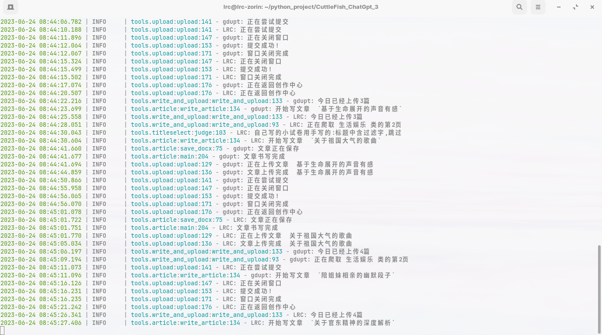
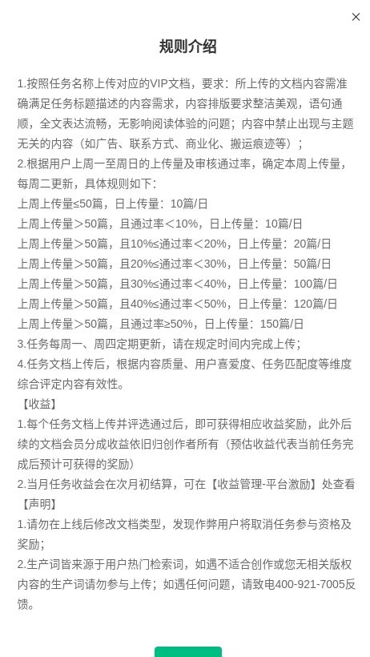

# CuttleFish_ChatGpt2.0
整体实现流程：

1.通过selenium抓取百度文库的题目信息

2.标题过滤

3.调用gpt3.5根据文章标题写文章

4.将返回的文章写入word文档

5.将word文档转化为pdf文档(可选)

6.通过selenium实现自动上传

7.转回到第一步循环

# 
> **说在前面**
> 
> 在文库更新规则前，一天最多可以上传100篇文章，最多可以5个账号同时跑，一个月就可以搞到5000多元，部分统计数据如下图(是不是很诱人)
> # 
> 
> 但是，后面百度文库更新了规则(如下图)，现在每天上传文章数量的限制和通过率挂钩了，但是gpt写的文章通过率大约在30%~40%，香饽饽瞬间就变得不香了（f**k，百度你是不是玩不起）
> # 
<div align="center">
  
  
  
  
  
</div>

## 如果你可以看到这里，说明你对这个项目还有兴趣(反正我是没啥兴趣了，搞不到大钱哪有兴趣哦)。既然你有兴趣，那我就教你怎么去部署这个项目
前提：1.本项目只适用于windows系统，linux系统用户自己把代码中有关win32的库自己注释掉(不过我想不会有人那么蛋疼用linux系统吧，当然我不是在说我自己)；2.本项目不适合python小白，至少你要会安装python吧(python你都装不明白还是先去把基础搞好)

### 预备
注册百度墨斗鱼知识店铺并绑定你的银行卡(你不绑卡百度把钱打给空气啊)

下载一个翻墙软件(这里推荐使用clash，如果用其他软件要修改[tools/article.py](https://github.com/LUORANCHENG/CuttleFish_ChatGpt2.0/blob/main/tools/article.py)下的第136行和137行的端口号)(我也很无奈，因为openai要翻墙才能用，国内局域网，国外互联网)

### 1.安装依赖
```
pip install -r requirements.txt
```

### 2.安装chrome浏览器和chromedriver
安装chrome浏览器就不用我多说了吧(小学生都会)

安装好后查看自己chrome浏览器的版本(如下图)
# 

然后到这个网址下载相应版本的驱动：[chrome驱动](http://chromedriver.storage.googleapis.com/index.html)。到这里就可能有的小伙伴会问了：Oh,shit！这里面怎么只有win32版本的驱动，老子的电脑可是高贵的X64架构的；我的回答是：你就下32位版本的，在64位的电脑上也能用。

然后把chromedriver.exe的地址添加到环境变量path里面

一定要注意的是， 加入环境变量 Path 的，

不是浏览器驱动全路径，比如 d:\tools\chromedriver.exe

而是 浏览器驱动所在目录，比如 d:\tools

而且设置完环境变量后，别忘了重启IDE（比如 PyCharm） 新的环境变量才会生效。

（这一步不再详细讲述，不懂的看这篇教程:[windowns系统chromedriver安装与环境变量配置](https://ceshiren.com/t/topic/21687)

### 3.修改setting.json文件
此文件在[conf/](https://github.com/LUORANCHENG/CuttleFish_ChatGpt2.0/blob/main/conf/settings.json)目录下(我相信你可以找到的)
关键字 | 功能
--- | ---
ignore_words | 敏感词(自动跳过包含这些词的文章题目)
api_key | openai的api_key(当前程序正在使用的api_key)(此处要改成自己的api_key)
api_keys | openai的api_key池(用于自动更换api_key)
used_keys | 已经用完的api_key
article_log_path | 文章日志的目录(改成自己的路径)
backup_path | 文章备份路径(改成自己的路径)
log_path | 日志路径(改成自己的路径)
temp_path | 保存要上传文章的临时目录(改成自己的路径)

### 4.修改account.csv文件
account.csv文件在项目的根目录下，先在account.csv里面写自己的百度账号密码 用户名是为了自己方便辨识(相信我，我不会看到你们的密码的)

### 5.修改main.py里面的params参数
main.py在项目的根目录下,在main里面对params进行设置,各种参数都有注释(不建议开启转pdf功能，因为在多线程下容易堵塞，都怪我技术水平菜，不会修)

## 6.运行main.py
一切准备就绪后，运行main.py文件，享受搞钱的乐趣吧


